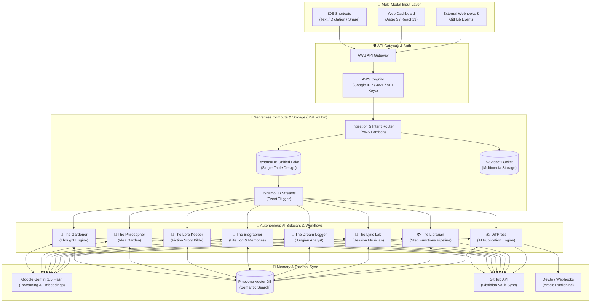
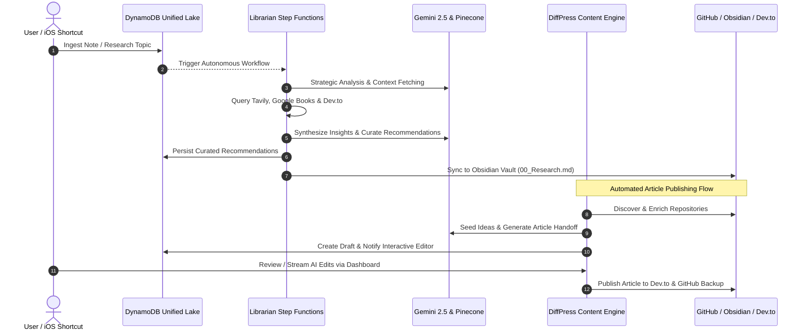

<div align="center">

# 🌌 Constellation Engine

**A Serverless, AI-Powered Operating System & Second Brain for Creativity, Autonomous Research, and Content Publishing.**

[](https://sst.dev)
[](https://aws.amazon.com)
[](https://ai.google.dev)
[](https://pinecone.io)
[](https://www.typescriptlang.org)
[](https://astro.build)
[](https://react.dev)
[](https://tailwindcss.com)

</div>

---

## 🔭 Overview & Mission

The **Constellation Engine** is a personal **"Second Brain"** designed to bridge the gap between **High-Throughput Ideation** (fleeting thoughts, dreams, random ideas, voice dictation) and **High-Latency Processing** (writing, synthesis, archiving, autonomous research, and publication).

Instead of a passive, static note-taking app, Constellation Engine is an **active, living operating system**. Whenever new data is ingested, an autonomous AI "Gardener" and specialized domain personas actively tend to the ecosystem—clustering thoughts, checking fiction story continuity, analyzing dream symbols, curating external literature, and drafting publishable articles in the background.

---

## ✨ Key Capabilities & Highlights

* 🏗️ **Serverless Event-Driven Architecture:** Powered by AWS Lambda, DynamoDB Streams, and Step Functions via **SST v3 (Ion)** for zero-idle compute cost and massive scalability.
* 🧠 **Semantic Vector Memory:** Integrates **Pinecone** serverless vector databases with **Google Gemini 2.5 Flash** embeddings for Retrieval-Augmented Generation (RAG) and historical memory resonance.
* 🗄️ **Unified Lake Architecture:** Built on a single-table DynamoDB design that seamlessly connects user entries, metadata, living dashboards, and asynchronous background worker queues.
* 🤖 **Autonomous AI Sidecars:** Specialized AI personas that independently process, synthesize, and maintain living documents tailored to specific creative domains.
* 📚 **Autonomous Research Pipeline (The Librarian):** An AWS Step Functions workflow that orchestrates multi-source literature retrieval (**Tavily API**, **Google Books**, **Dev.to**, and **GitHub**) to curate actionable reading lists and strategic analyses.
* ✍️ **AI Publication Engine (DiffPress):** End-to-end automated publishing pipeline that discovers and enriches GitHub repositories, seeds article ideas, generates structured handoffs, drafts technical posts, provides an interactive streaming AI chat editor, and publishes directly to Dev.to and webhooks.
* 📱 **Multi-Modal Frontend & Obsidian Sync:** Combines headless iOS Shortcuts (text, dictation, share sheet), an **Astro 5 + React 19** web dashboard, and seamless bidirectional GitHub Markdown synchronization with local **Obsidian** vaults.
* 🔐 **Enterprise Security:** Secured via AWS Cognito User Pools (with Google Identity Provider support), JWT authorizers, and API key verification.

---

## 🏗️ System Architecture & Data Flow

### High-Level Architecture



### Autonomous Research & Publication Workflow



---

## 🧩 The "Sidecar" Modules & Personas

The engine implements a **"Sidecar Pattern,"** routing different types of input to specialized AI personas that maintain stateful markdown dashboards and databases.

| Persona / Module | Role | Function & Responsibilities | Output Dashboard |
| :--- | :--- | :--- | :--- |
| **🧠 The Thought Engine** | *The Gardener* | Clusters loose thoughts into emergent topics ("Constellations"). Distinguishes between raw **Ideas** (seeds), active **Drafts** (plants), and **Sources** (fertilizer). | `00_Current_Constellations.md` |
| **🔮 The Philosopher** | *The Synthesis Engine* | Cultivates the "Idea Garden" by analyzing intellectual evolution, tracking current obsessions, synthesizing theories, and posing open questions. | `00_Idea_Garden.md` |
| **📖 The Lore Keeper** | *The Continuity Editor* | Maintains a living Story Bible for fiction writers. Tracks world rules and character arcs, separates scene drafts from metadata, and flags plot contradictions. | `00_Story_Bible.md` |
| **🧬 The Biographer** | *The Family Archivist* | Unifies daily journal entries and recovered memories. Analyzes mood and milestones, using vector search to surface past memories that resonate with today's events. | `00_Life_Log.md` |
| **🌙 The Dream Logger** | *The Jungian Analyst* | Processes morning dream descriptions to track recurring symbols, archetypes, and subconscious emotional trajectories over time. | `00_Dream_Journal.md` |
| **🎵 The Lyric Lab** | *The Session Musician* | Evaluates meter, cadence, and rhyme schemes rather than just semantic meaning. Connects "Orphan Lines" into structured song concepts. | `00_Lyric_Lab.md` |
| **📚 The Librarian** | *The Research Assistant* | An AWS Step Functions orchestrated workflow that researches user topics across external APIs (Tavily, Google Books, Dev.to), performing strategic analysis and literature curation. | `00_Research_Library.md` |
| **✍️ DiffPress** | *The Content Engine* | An autonomous publisher that scans GitHub repositories, generates content ideas, drafts technical blog posts, provides streaming AI chat editing, and publishes directly to Dev.to. | `00_DiffPress_Dashboard.md` |

---

## 🗄️ Unified Lake Data Schema (Single-Table Design)

The backend utilizes AWS DynamoDB with a single-table design (`UnifiedLake`) that streams real-time modifications to asynchronous background workers:

| Primary Key (`PK`) | Sort Key (`SK`) | Entity Type | Description |
| :--- | :--- | :--- | :--- |
| `USER#<id>` | `ENTRY#<id>` | Ingested Note | Raw thoughts, drafts, journal logs, or articles |
| `USER#<id>` | `METADATA` | User Profile | User settings, Cognito identity, API preferences |
| `DASHBOARD#<persona>` | `STATE` | AI Persona State | Living markdown summary maintained by AI sidecars |
| `REPO#<owner>/<name>` | `METADATA` | DiffPress Repo | Enriched repository metadata and feature analysis |
| `HANDOFF#<id>` | `METADATA` | Article Handoff | Automated content generation task pipeline |

---

## 🚀 Tech Stack

### Cloud & Infrastructure
* **Framework:** [SST v3 (Ion)](https://sst.dev)
* **Serverless Compute:** AWS Lambda, AWS Step Functions, AWS API Gateway
* **Database & Storage:** AWS DynamoDB (Streams enabled), AWS S3, AWS SSM
* **Authentication:** AWS Cognito User Pools (Google Identity Provider & JWT Authorizers)

### Artificial Intelligence & Data
* **LLM & Reasoning:** [Google Gemini 2.5 Flash](https://ai.google.dev) (`@google/genai`)
* **Vector Database:** [Pinecone](https://pinecone.io) Serverless Vector Index (`@pinecone-database/pinecone`)
* **External APIs:** Tavily AI Search, Google Books API, Dev.to API, Octokit (GitHub API)

### Frontend & Web Dashboard
* **Web Framework:** [Astro 5](https://astro.build) & [React 19](https://react.dev)
* **Styling & UI:** Tailwind CSS v4, Radix UI Primitives, Lucide Icons
* **State Management & Tooling:** Zustand, Vite, TypeScript, Zod, Vitest

---

## 📂 Project Structure

```text
constellation-engine/
├── src/
│   ├── biographer.ts / biographerAsync.ts # Biographer persona handlers
│   ├── dreams.ts                          # Dream Logger handler
│   ├── fiction.ts                         # Lore Keeper handler
│   ├── ingest.ts                          # Main ingestion & Intent Router
│   ├── lyrics.ts                          # Lyric Lab handler
│   ├── philosopher.ts                     # Philosopher / Idea Garden handler
│   ├── components/                        # React 19 UI components (Radix + Tailwind v4)
│   ├── diffpress/                         # DiffPress AI Content Engine & publishing suite
│   ├── librarian/                         # Librarian Step Functions research pipeline
│   ├── lib/                               # DynamoDB schemas, AWS clients & utilities
│   ├── pages/                             # Astro 5 web dashboard pages
│   └── workers/                           # Async background workers (GitHub backup, etc.)
├── docs/                                  # Tech specs, implementation plans & architecture
├── sst.config.ts                          # AWS infrastructure definition (SST v3 Ion)
├── astro.config.mjs                       # Astro web application config
└── package.json                           # Dependencies & scripts
```

---

## ⚡ Getting Started

### 1. Prerequisites
* **Node.js:** v20 or higher
* **AWS Account:** Configured locally with appropriate IAM permissions
* **API Keys Required:**
  * Google Gemini API Key (`GEMINI_API_KEY`)
  * Pinecone API Key & Index Host (`PINECONE_API_KEY`, `PINECONE_INDEX_HOST`)
  * GitHub Personal Access Token (`GITHUB_TOKEN`, `GITHUB_OWNER`, `GITHUB_REPO`)
  * Optional: Tavily, Google Books, and Dev.to API keys for Librarian & DiffPress modules

### 2. Installation & Setup

Clone the repository and install dependencies:

```bash
git clone https://github.com/thephilgray/constellation-engine.git
cd constellation-engine
npm install
```

Configure your environment secrets via SST:

```bash
npx sst secret set GEMINI_API_KEY "your-gemini-api-key"
npx sst secret set PINECONE_API_KEY "your-pinecone-api-key"
npx sst secret set GITHUB_TOKEN "your-github-token"
```

### 3. Local Development

Start the Astro local dev server and SST live Lambda development environment:

```bash
# Start Astro frontend locally
npm run dev

# Start SST v3 live dev environment (in a separate terminal)
npx sst dev
```

### 4. Production Deployment

Deploy the serverless infrastructure and web dashboard to AWS:

```bash
npm run deploy:prod
```

---

<div align="center">
  <p>Built with ❤️ by Phillip Gray & the Constellation Engine Contributors.</p>
</div>
